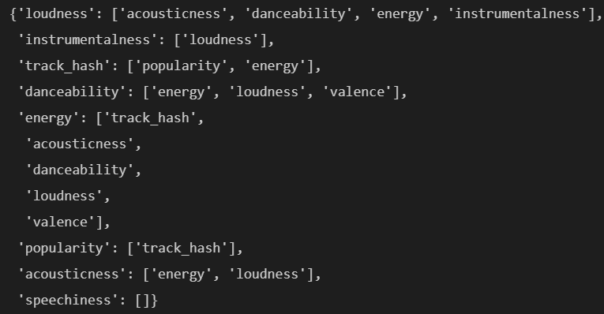

# CORE: Exploring and understanding the Data 

##### (20 marks) Highlight the findings of your dataset exploration. You should identify four important patterns (e.g. large correlation between variables), and discuss the potential consequence this may have on your results. To achieve a high mark, you should consider more complicated patterns, such as feature interactions. Use your judgement and justify what is an important pattern.

Due to there are lots of datasets in there, so the first thing that I do is to merge them into a whole dataset called merged_dataset except for the testing-instances dataset. Then, I use pandas-profile to generate the report based on this whole merged_dataset. By observing the report and googling the definition for each field( [[1]](https://rpubs.com/PeterDola/SpotifyTracks) and [[2]](https://towardsdatascience.com/is-my-spotify-music-boring-an-analysis-involving-music-data-and-machine-learning-47550ae931de)), for feature columns, I find that although there are no missing values by using python, but there are some potential missing values for several features. The initial findings for each feature are described at below: 

+ 'instance_id' is unique, which means the percentage of distinct is 100%
	+ For avoiding the over-fit issue during training, I decide to delete this column at start, since it is absolutely unnecessary feature. 
+ For features that has potential missing value: (on the right screenshot)
	+ =='artist_name'== is the category variable which has empty_field as the individual category to capture the missing values.
	  + Through the observation, it is uniform distributed across all datasets(~ 5% missing for each), which cause the total missing percentage is less than 5% as well. Therefore, I think it is MCAR, which means rows can be deleted where artist_name is missing, which is the operation that I do on this feature.
	+ Undoubtedly, =='duration_ms'== is a numerical feature that values should always be positive. However, there are about 10% rows that has -1 as its value, which indicates they are missing. 
		+ The distribution of missing also is the same as previous, which means it is MCAR as well. However, from slide14, I obtain that Deletion approach should only be applied when it is MCAR and missing percentage is less than 5%. 
		+ So, I choose to use the Imputation approach, which try to use the global mean value to fill the NA.
	+ From [[1]](https://rpubs.com/PeterDola/SpotifyTracks) and [[2]](https://towardsdatascience.com/is-my-spotify-music-boring-an-analysis-involving-music-data-and-machine-learning-47550ae931de), I know that ==‘tempo’== should be the numerical feature, but due to it has ‘?’ represents the missing value, so python recognize it as the categorical feature. It is also the MCAR which is the same reason as previous. There are also about 10% missing.
		+ The same as previous ‘duration_ms’ one, I choose to use global mean to fill the NA

After dealing with these missing values, I start to encode the categorical variables. For encoders, I use Label encoder and ordinal encoder where label encoder to encode the ‘music_genre’ and ‘mode’. Since ‘mode’ has only 2 categories(i.e. Major and Minor), so I think it is fine to use the label encoder. For ordinal encoder, it is used to encode  remaining categorical variables. 

Up to now, all variables are encoded into the numerical, then I use the StandardScaler() to do the normalisation on all features except the class label. This step is fundamental and essential since it let the scales of every feature to be unified so that no machine learning models will be affected by ununified scales. 

After above steps are finished, then I actually start to identify the important patterns by  finding the  high correlation between the music_generic class variable and others . There are 2 correlation methods are used by me, one is based on Pearson's correlation coefficient (r), which is a measure of linear correlation between two variables, it correspond to ==data.corr()== method. The value lies from -1 to +1. -1 indicating total negative linear correlation, 0 indicating no linear correlation and 1 indicating total positive linear correlation. Also, it is worth to note that it only support numerical variables, but up to now, everyone is numerical, so it’s fine. The other heatmap is based on ==phik==, it is another practical correlation coefficient. It can not only *work consistently between categorical, ordinal and interval variables, but also captures non-linear dependency,*it correspond to==data.phik_matrix()==method. For this phik, the value lies between 0 and 1, which means if the value is higher, then they are high correlated. Heatmap of them are shown below.

<div align="center">
 
 
</div><div align=center>


</div>

First, let us look at the Pearson’s r, the heatmap is shown on the top left. For finding the important variables that are high correlated to music_genre, the corrlation value 0.5 is used by me to select features, it can make sure they are all high linear correlated, in which irrelevant features are dropped. For the readability, matched columns and the corresponding correlated value are shown on the left screenshot in black. We can see only track_hash and popularity is greater than 0.5.

Then, I do the same thing on phik, screenshots of phik heatmap and matched features with corr value are shown on the top right. We can see there are more variables high correlated with Class Label in phik. By taking the union of these 2 methods, on the screenshot left below, we can see there are 8 obvious high correlated variables with Class Label.


**Among these 2 methods, we can clearly see phik has more matched features than pearson’s. Therefore, seems like more varibles are non-linear correlated to the Class label music_genre. Anyway, we can observe track_hash and popularity occur on both methods which is the highest and 2nd highest. Therefore, there is no doubt that ‘track_hash ’ and ‘popularity’ are the most important variables to the Class Label. For the rest, we can also see the  corr value of ‘loudness’, ‘energy’, ‘acousticness’  are greater then 0.67, which are also are very important pattern with the Class label. This means in the future training process, the consequence that we may observe is these variables got higher weights then other variables since they are high correlated with Class Label thus they are important .*

From now on, obvious high correlated variables are identified successfully. For further exploration on feature interaction, we need to find the high correlated variables of these 8 features. To do this, I use phik correlation method to find the potential high corelated variables which greater then 0.5 for each of these 8 matched features. The code and output for this operation is shown below.

```python
dict = {}
for fea in matched_features:
    temp_dict,_ = find_feature_name_between_2_vars(cor_method_name="phik",var1=fea,corr_val=0.5)
    dict.update(temp_dict)
dict
```

**From the left screenshot, we can see clearly how these 8 features interact with each other.  For instances of the most important variable, which is ‘track_hash’. We can see ‘track_hash’ is high correlated with ‘popularity’ and ‘energy’. This means ‘track_hash’ depend on these two variables, if the value of ‘track_hash’ changes, then ‘popularity’ and ‘energy’ will be greatly affected by it(i.e. if the value of track_hash changes, then values of these 2 variables most likely changed), vice verse. For another instance, we can see ‘speechiness’ does not contain anything, this means it is a pretty independent variables compare to others, which means if it changes, other variables will not be affected, vice verse.*

##### (20 marks) Visualisation is an important aspect of this task. Please illustrate at least one important finding of your work using visualisation. For full marks, you should be expected to use more than a simple scatter plot.

The visualisation that I choose are all based on the potential patterns that are shown on the last part of previous question, which is the part you just read it . 
<div align=center>

</div>
Both of them are all scatter plot, the class label ‘music_genre’ is used as the hue parameter in which produce points with different colours based on its class, so we can clearly see the visualisation of correlation between X-axis and Y-axis variable where the X-axis is energy for both plots and Y-axis is popularity for the left scatter plot and loudness for the right plot.

Continue from what we discover from last question, which is energy and popularity are high correlated with track_hash, but ‘energy ’ and ‘popularity ’ are independent to each other, so that one change will not affect the other one. Therefore, we can clearly observe this from the left scatter plot where the boundary between different class of music_genre is straight forward and clear.

Then, let’s look at the right scatter plot. Unlike the plot that we see from left one, the energy and loudness are high correlated with each other, which means one variable changes will greatly affect the other one. Therefore, as we can see the right scatter plot, most of them are overlapping with each other across all different value that these 2 variables contains, which prove the theory that one changes greatly affect the other one.

# Completion: Developing and testing your machine learning system

##### (15 marks) Discuss the initial design of your system, i.e. before you have submitted any predictions to the Kaggle competition. Justify each decision you made in its design, e.g. reference insight you gained in the Core part.

Actually most details of my initial design is described at Core part, but anyway, I will repeat the important part. First, from the initial observation, I find that there are potential missing values which is one categorical (2.5% missing)and 2 numerical(5% missing) which is shown on the top right screenshot. In my initial design, for dealing with them, I choose to drop all categorical missing values and use global mean value to replace numerical missing value. Then, for the encoder choice , I choose to use label encoder to encode ‘mode’ and ‘music_genre ’, and ordinal encoder to encode the rest.  Actually, through the knowledge from [[4]](https://zhuanlan.zhihu.com/p/117230627), ordinal encoder is better to suit the values has order. For instance, the categorial variable ‘obtained_date’ has the obvious order and from [[1]](https://rpubs.com/PeterDola/SpotifyTracks) and [[2]](https://towardsdatascience.com/is-my-spotify-music-boring-an-analysis-involving-music-data-and-machine-learning-47550ae931de), we can know ‘key’ also has the potential logic order, so these 2 are the best suit for ordinal encoder. 

However, for remaining, ordinal encoder may not be the best choice that could cause potential issue like under-fit. In my initial design, I also try to use ==OHE(i.e. one hot encoder )==since it does not require the feature must have the logical order, but finally I still choose to use the ordinal encoder. This is because from[[4]](https://zhuanlan.zhihu.com/p/117230627), I can see OHE is the best suit for features *only* holds 5 categorical values since OHE increase dimensions which brings the curse of dimensionality and so that the training is hard to implement. Therefore, although ordinal encoder can not help, but there are no alternatives.

For the feature selection, in my initial design, only these 8 features shown on the right screenshot are selected for fitting the ML model since they are all high correlated with the genre class label. Others are dropped since I believe they are unnecessary features that can only bring the confusion to the machine learning model which may cause the bias and overfit.
Then, after train_test split, I choose to use random forest classifier as my first model to fit since it is an ensemble technique that within count several weak model together in order to get the best performance. However, as we can see my accuracy scores shown on the left, the accuracy always greater then 0.93, which is strange. To address this issue, I look up the internet and I find that ‘track_hash’ is a kind of the real world identification card number that is unique which associated with each music instance just like unique id associate with each individual person, so, it cause the data leakage which brings the high accuracy score .

For validating the real reliable performance, I delete the track_hash, and the left screenshot indicates my first initial design accuracy is 0.543. Then I use my initial design to submit to Kaggle and I get 0.53544 for the 1st Kaggle submission.


##### (25 marks) Discuss the design of one or more of your intermediary systems. Justify the changes you made to the previous design based on its performance on the leaderboard, and from any other additional investigation you performed.

`Since I do some minor changes, the output of my submitted ipynb is not the Kaggle Version 4, but the source code are about the same. If you really need to do the authentication, I can share the github link to prove it. `

```python
cv = KFold(n_splits=5, shuffle=True, random_state=250)
model_dict = get_models()
for model in model_dict.keys():
    scores = cross_val_score(model, X, y, scoring='accuracy', cv=cv, n_jobs=-1)
    model_dict[model] = scores
```

From [0] and [8], I obtain that in order to improve the accuracy, the **Cross-Validation(aka. CV)** and more machine learning models should be used. This is because for the general case where only has train test set, the accuracy is largely depend on the split of whole dataset. For instances, for this split, this model may perform much more higher then others, but if the split is changed, then it may not be the best, so the consistency can not be kept and it is hard to decide which ML model and which model combination parameters is the best suit for current dataset. The reason for this is that model did not train and fit on all instances, which is similar as the case that current year exam(Kaggle) are from questions dataset, but you only train on the part of questions(train set) from questions dataset, so you will not know how to do questions you did not train on current year exam(Kaggle), so it cause the performance bias and non-consistency. 

Therefore, build on my initial design, more machine learning models and CV set are introduced in my 2nd and 3rd Kaggle submission. The above code snippets indicates that I use K-fold with 5 as my Cross-Validation, and the right screenshot indicates different machine learning models that I put, and the below==right screenshot on next question==is from 4th submission system which shows the best suit ML model Rank associated with its accuracy score. We can see the mean acc of Rank 0 is 0.5718 and the model is ==MLPClassifer(alpha=1e-05,max_iter=500,random_state=250)==.  Since the CV (K-Fold) is introduced, so the consistency is guarantee which make this RANK reliable. For validating this, my 4th submission use Rank 0, and 5th submission choose Rank 5. The Kaggle of my 4th acc is higher then 5th acc, which meet the expectation.

##### (10 marks). Use your judgement to choose the best system you have developed — this may not necessarily be the most accurate system on the leaderboard. Make sure you select this submission as your final one on the competition page before the deadline. Explain why you chose this system, and note any particularly novel/interesting parts of it. You should submit screen captures and/or the source and executable code required to run your chosen submission so that the tutors can verify its authenticity. 	

I think my best system that I have developed is my 4th submission, which is the one with the most accurate system. The screenshot on the right indicates the performance on the given dataset, which is the mean score of the best model is 0.5718, and on Kaggle, I receive 0.56661. Although it is a bit lower on actual Kaggle prediction,but it is in the range which means it is not over-fit.

Reasons for chosen this system to be the best are:

a). It use Cross-Validation set and multiple machine learning  models in order to get the best.

b). I do the feature selection again to add ==‘valence’== to the final selected feature list, thus the performance upgraded to become the highest. 

- During the EDA process in core part where to find and identify the important patterns, at the feature interaction part, I observe that ‘track_hash’ is a kind of unique id that associated with each music instance, so it cause the data leakage which brings the high accuracy score. Although ‘track_hash’ need to be deleted, it also remind me that we should treat ‘track_hash ’ as the important most important variable which is the same as music_genre class. Hence, from ‘track_hash’ perspective, we obtain that popularity and energy are high correlated with it. And for popularity, there is nothing to be concentrate it, but for energy, there are a lot. From the energy’s perspective, there is a surprising thing in which ==‘valence’== is the candidate that high correlated with energy although it’s not high correlated with either class label or track_hash. On my 4th Kaggle submission, this feature is added, and the accuracy upgrade from 0.547 to 0.5611, which is a great upgrade and be the best among all my submission. The potential final selected features are listed below on the screenshot.


# Challenge: Reflecting on your findings

##### (10 marks) How easy is it to interpret your chosen machine learning model, i.e. how easy to comprehend why certain predictions have been made? 

##### If your model is difficult to interpret, do you see any problems with this? (e.g. whether users will trust your model? whether it is difficult for the deployment of your solution or to use the model? and so forth.) How would it compare to a simpler model, e.g. a simple K-Nearest neighbour? 

##### If your model is easy to interpret, what are its limitations? (e.g. whether it can catch the underlying relationship in the data? whether it can provide accurate predictions?) How would it compare to a more complex model, such as a ensemble method (e.g. random forest) 	

My chosen model is ==MLPClassifer==. As we can see from Completion part, through the K-fold validation, among all the ML models that I add, the rank of MLP always occur at the best 5, just the controller parameter is different. For the MLP classifier(i.e. neural network), max_iter indicates the iteration time in order to avoid over-fit, and the random_state generate the random seed which make sure the consistent consequence. The **most important controller is 'alpha'**, from lecture slides, we can know this controller introduce a penalty, to encourage the weight values to stay “small” (means a smoother boundary).  This generalises the hyperplane decision boundary in the space of input vectors into the more complicated boundary. From my rank, we can see ‘alpha ’ as the penalty coefficient, the lower perform the better result. I think it is because the MLP is the neural network and the idea of it is from the human brain, so only a suitable penalty can let the human perform better next time, not a too big or too small penalty, this theory also makes sense on the MLP classifier.


# Reference:

0. School slides and tutorials

1. https://towardsdatascience.com/is-my-spotify-music-boring-an-analysis-involving-music-data-and-machine-learning-47550ae931de

2. https://rpubs.com/PeterDola/SpotifyTracks

3. https://stackoverflow.com/questions/13413590/how-to-drop-rows-of-pandas-dataframe-whose-value-in-a-certain-column-is-nan

	- It contains everything about different ways of delete NA

4. https://zhuanlan.zhihu.com/p/117230627


Cross Validation:

5. https://scikit-learn.org/stable/modules/cross_validation.html
6. https://scikit-learn.org/stable/modules/generated/sklearn.model_selection.RepeatedKFold.html#sklearn.model_selection.RepeatedKFold
7. https://machinelearningmastery.com/how-to-configure-k-fold-cross-validation/
8. https://www.codespeedy.com/improve-accuracy-of-machine-learning-model-in-python/

