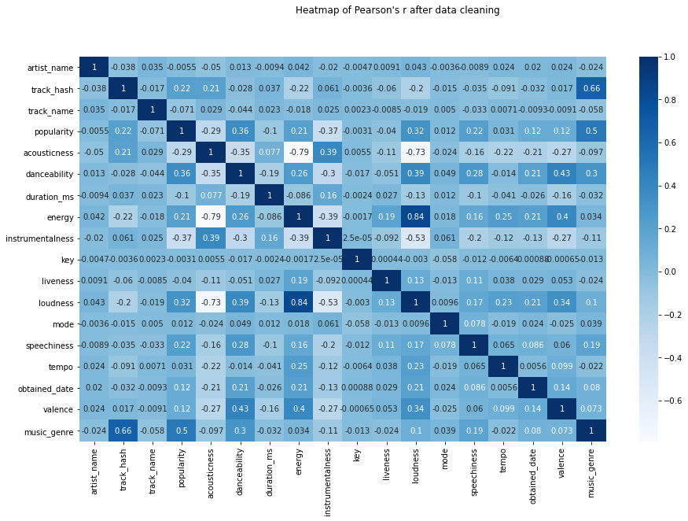

# CORE: Exploring and understanding the Data 

`no more than 2.5 pages!!!!!!!!`

##### (20 marks) Highlight the findings of your dataset exploration. You should identify four important patterns (e.g. large correlation between variables), and discuss the potential consequence this may have on your results. To achieve a high mark, you should consider more complicated patterns, such as feature interactions. Use your judgement and justify what is an important pattern.

Due to there are lots of datasets in there, so the first thing that I do is to merge them into a whole dataset called merged_dataset except for the testing-instances dataset. Then, I use pandas-profile to generate the report based on this whole merged_dataset. By observing the report and googling the definition for each field( [[1]](https://rpubs.com/PeterDola/SpotifyTracks) and [[2]](https://towardsdatascience.com/is-my-spotify-music-boring-an-analysis-involving-music-data-and-machine-learning-47550ae931de)), for feature columns, I find that although there are no missing values by using python, but there are some potential missing values for several features. The initial findings for each feature are described at below: 

+ 'instance_id' is unique, which means the percentage of distinct is 100%
	+ For avoiding the over-fit issue during training, I decide to delete this column at start, since it is absolutely unnecessary feature. 
+ For features that has potential missing value: (on the right screenshot)
	+ =='artist_name'== is the category variable which has empty_field as the individual category to capture the missing values.  ~~so leave  it alone since it capture missing value~~ 	
	  + Through the observation, it is uniform distributed across all datasets(~ 5% missing for each), which cause the total missing percentage is less than 5% as well. Therefore, I think it is MCAR, which means rows can be deleted where artist_name is missing, which is the operation that I do on this feature.
	+ Undoubtedly, =='duration_ms'== is a numerical feature that values should always be positive. However, there are about 10% rows that has -1 as its value, which indicates they are missing. 
		+ The distribution of missing also is the same as previous, which means it is MCAR as well. However, from slide14, I obtain that Deletion approach should only be applied when it is MCAR and missing percentage is less than 5%. 
		+ So, I choose to use the Imputation approach, which try to use the global mean value to fill the NA.
	+ From [[1]](https://rpubs.com/PeterDola/SpotifyTracks) and [[2]](https://towardsdatascience.com/is-my-spotify-music-boring-an-analysis-involving-music-data-and-machine-learning-47550ae931de), I know that ==‘tempo’== should be the numerical feature, but due to it has ‘?’ represents the missing value, so python recognize it as the categorical feature. It is also the MCAR which is the same reason as previous. There are also about 10% missing.
		+ The same as previous ‘duration_ms’ one, I choose to use global mean to fill the NA

After dealing with these missing values, I start to encode the categorical variables. For encoders, I use Label encoder and ordinal encoder where label encoder to encode the ‘music_genre’ and ‘mode’. Since ‘mode’ has only 2 categories(i.e. Major and Minor), so I think it is fine to use the label encoder. For ordinal encoder, it is used to encode  remaining categorical variables. 

Actually, through the knowledge from [[4]](https://zhuanlan.zhihu.com/p/117230627), this ordinal encoder is better to suit the values has order. For instance, the categorial variable ‘obtained_date’ has the obvious order and from [[1]](https://rpubs.com/PeterDola/SpotifyTracks) and [[2]](https://towardsdatascience.com/is-my-spotify-music-boring-an-analysis-involving-music-data-and-machine-learning-47550ae931de), we can know ‘key’ also has the potential logic order, so these 2 are the best suit for ordinal encoder. 

However, for remaining, I also use ordinal encoder as well, which is not the best choice that could cause under-fit. I also try to use ==OHE(i.e. one hot encoder )==since it does not require the value of feature should has the order , but I unable to do it since it requires huge spare RAM that my PC does not have. By googling, from[[4]](https://zhuanlan.zhihu.com/p/117230627), I can see OHE is the best suit for features only holds 5 categorical values  since OHE increase dimensions which brings the curse of dimensionality and so that the training is hard to implement. Therefore, choose ordinal encoder can not help but no alternatives. ==~~Target Encoder(Mean Encoder)~~==

Up to now, all variables are encoded into the numerical, then I use the StandardScaler() to do the normalisation on all features except the class label. This step is fundamental and essential since it let the scales of every feature to be unified so that no machine learning models will be affected by ununified scales. 

After above steps are finished, then I actually start to identify the important patterns by  finding the  high correlation between the music_generic class variable and others . There are 2 correlation methods are used by me, one is based on Pearson's correlation coefficient (r), which is a measure of linear correlation between two variables, it correspond to ==data.corr()== method. The value lies from -1 to +1. -1 indicating total negative linear correlation, 0 indicating no linear correlation and 1 indicating total positive linear correlation. Also, it is worth to note that it only support numerical variables, but up to now, everyone is numerical, so it’s fine. The other heatmap is based on ==phik==, it is another practical correlation coefficient. It can not only *work consistently between categorical, ordinal and interval variables, but also captures non-linear dependency,*it correspond to==data.phik_matrix()==method. For this phik, the value lies between 0 and 1, which means if the value is higher, then they are high correlated. Heatmap of them are shown below.

 
 

First, let us look at the Pearson’s r, the heatmap is shown on the top left. For finding the important variables that are high correlated to music_genre, the corrlation value 0.5 is used by me to select features, it can make sure they are all high linear correlated, in which irrelevant features are dropped. For the readability,  matched columns and the corresponding correlated value are shown on the left screenshot in black. We can see only track_hash and popularity is greater than 5.

Then, I do the same thing on phik, screenshots of phik heatmap and matched features with corr value are shown on the right. We can see that there are more variables that are high correlated with music_generic in phik. 

Among these 2 methods, we can clearly see phik has more matched features then pearson’s. Therefore, seems like more varibles are non-linear correlated to the Class label music_genre. Anyway, we can observe track_hash and popularity occur on both methods which is the highest and 2nd highest. Therefore, there is no doubt that ‘track_hash ’ and ‘popularity’ are the most important variables to the Class Label. For the rest, we can also see ‘acousticness’

##### (20 marks) Visualisation is an important aspect of this task. Please illustrate at least one important finding of your work using visualisation. For full marks, you should be expected to use more than a simple scatter plot.

# Completion: Developing and testing your machine learning system

You should refine your machine learning system a number of times (at least 3, including the initial system) based on the performance you achieve on the public leaderboard. `Your submitted report should contain up to 4 pages regarding the Completion component`

##### (15 marks) Discuss the initial design of your system, i.e. before you have submitted any predictions to the Kaggle competition. Justify each decision you made in its design, e.g. reference insight you gained in the Core part.

My initial design 

Within use track_hash:

##### (25 marks) Discuss the design of one or more of your intermediary systems. Justify the changes you made to the previous design based on its performance on the leaderboard, and from any other additional investigation you performed.

##### (10 marks). Use your judgement to choose the best system you have developed — this may not necessarily be the most accurate system on the leaderboard. Make sure you select this submission as your final one on the competition page before the deadline. Explain why you chose this system, and note any particularly novel/interesting parts of it. You should submit screen captures and/or the source and executable code required to run your chosen submission so that the tutors can verify its authenticity. 	

# Challenge: Reflecting on your findings

Until now, we have been focusing on achieving the best performance possible — but there should be some other aspects that ML tool users should consider, e.g. the interpretability of the model.

You should consider the interpretability of your final chosen model in this part. Your report (`1 page` on the Challenge component) should address the following questions:

- ##### (10 marks) How easy is it to interpret your chosen machine learning model, i.e. how easy to comprehend why certain predictions have been made?

-  ##### If your model is difficult to interpret, do you see any problems with this? (e.g. whether users will trust your model? whether it is difficult for the deployment of your solution or to use the model? and so forth.) How would it compare to a simpler model, e.g. a simple K-Nearest neighbour?

- ##### If your model is easy to interpret, what are its limitations? (e.g. whether it can catch the underlying relationship in the data? whether it can provide accurate predictions?) How would it compare to a more complex model, such as a ensemble method (e.g. random forest)

# Reference:

1. https://towardsdatascience.com/is-my-spotify-music-boring-an-analysis-involving-music-data-and-machine-learning-47550ae931de

2. https://rpubs.com/PeterDola/SpotifyTracks

3. https://stackoverflow.com/questions/13413590/how-to-drop-rows-of-pandas-dataframe-whose-value-in-a-certain-column-is-nan

	- It contains everything about different ways of delete NA

4. https://zhuanlan.zhihu.com/p/117230627

5. 

Cross Validation:

5. https://scikit-learn.org/stable/modules/cross_validation.html
6. https://scikit-learn.org/stable/modules/generated/sklearn.model_selection.RepeatedKFold.html#sklearn.model_selection.RepeatedKFold
7. https://machinelearningmastery.com/how-to-configure-k-fold-cross-validation/

